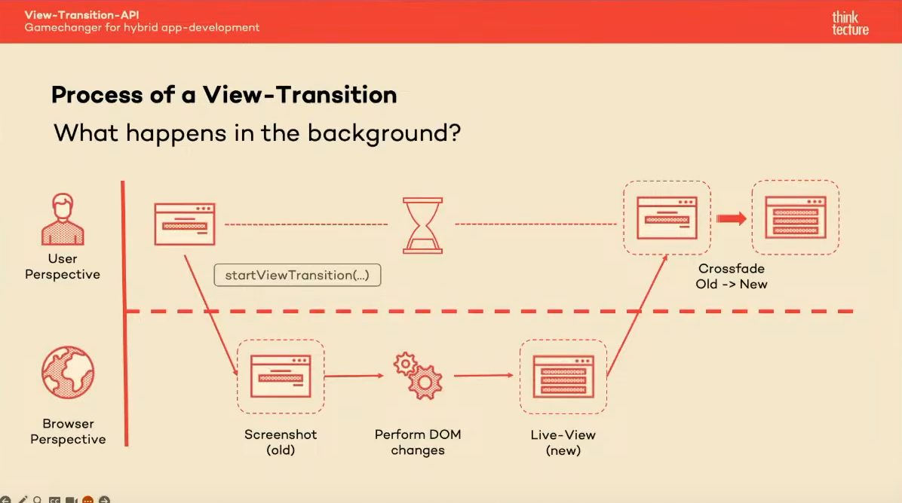
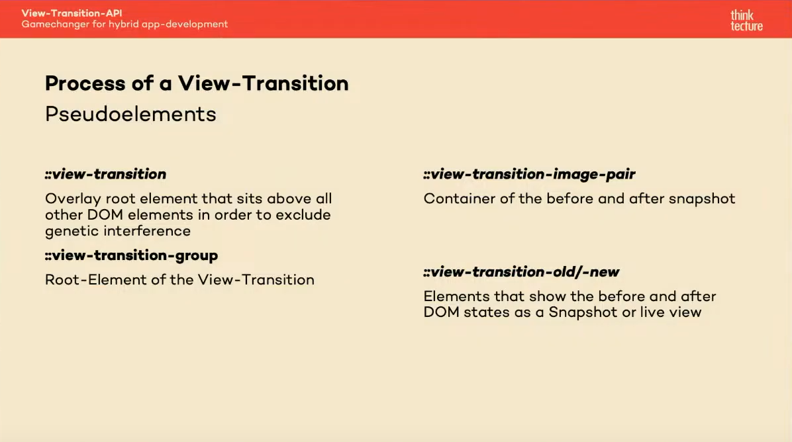

# View-Transition-API: Gamechanger for hybrid app-development

## Speaker

- Name: [Sascha Lehmann]
- Role: []
- Company/Organization: [Thinktecture AG]

## Lecture Summary

Due to the rapidly advancing development of web APIs (highlighting the Fugu project), the gap between Progressive Web Apps (PWA), hybrid development approaches, and native apps has been progressively narrowing. Even visually, they are hardly distinguishable from native apps. However, when it comes to animations, native apps have always had an edge due to the availability of native animation APIs. Complex animations, such as container transforms, were practically challenging to achieve in web apps without significant effort. That's right. They WERE. This gap can be closed thanks to the new View Transition API and Scroll-Driven Animations. And the best part is that it is almost entirely through CSS. Intrigued? Sascha Lehmann from Thinktecture will provide an overview of these new APIs, how to effectively implement them in your project, and their limitations.

## Key Takeaways


Example API:

```ts
  document.startViewTransition(() => someDOMManipulation())
```





### The good the bad and the ugly
 - Early days of browser support with Firefox still no support plans as of yet
 - Scoped transitions: A proposal for granular control over specific elements rather targeting the entire document 
 - Easy fluid animations

## Applicability

 - Browser support is less than ideal
 - Currently mostly limited to ease on the in between route navigation transition animations 


## Resources and Links

[Lecture Recording](https://www.youtube.com/watch?v=XrSCBCNgkFE)
[MDN](https://developer.mozilla.org/en-US/docs/Web/API/View_Transitions_API)
[Google examples of the API](https://developer.chrome.com/docs/web-platform/view-transitions)

